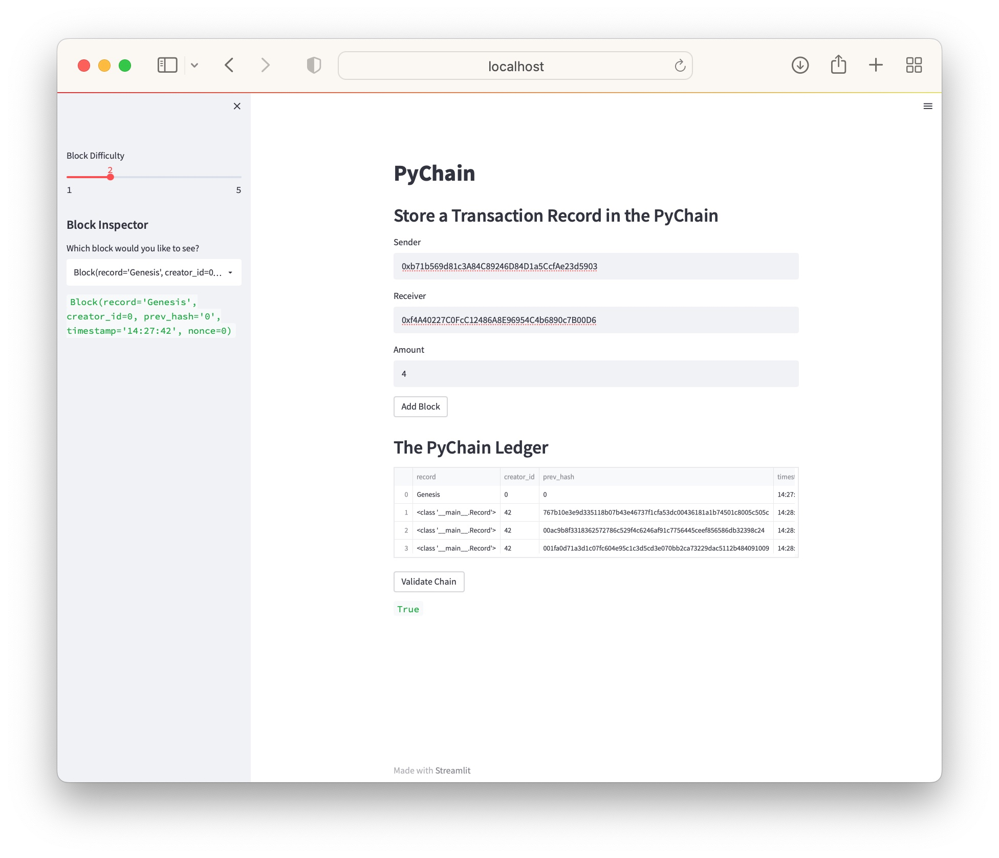

# PyChain Ledger

I created a blockchain app upsing streamlit library and python. There are three data classes in this app. **Record, Block and Pychain**. I used sha256 from Hashlib library to create the hashes for the pychain. The default difficulty for the **proof of work** function can be adjusted by a slider on the streamlit app. The pychain ledger will be printed as a dataframe object on the app.

To test the app, clone this repo to a direcotory in your local machine. Then follow the following steps.

Using terminal, get into the blockhain directory:

```
cd blockchain
```

Run the app on your terminal:

```
streamlit run pychain.py
```

To interact with the pychain ledger, provide input values for `sender`, `receiver` and `amount`.

Once you get the app running it should look like this

